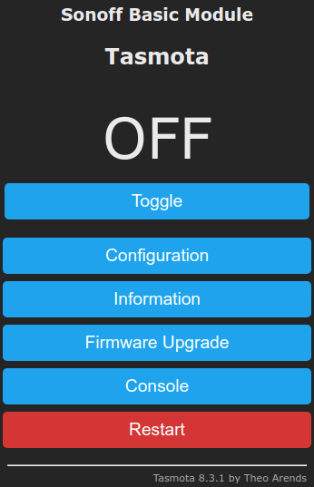
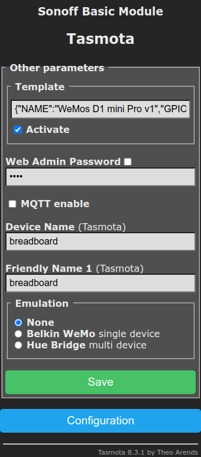
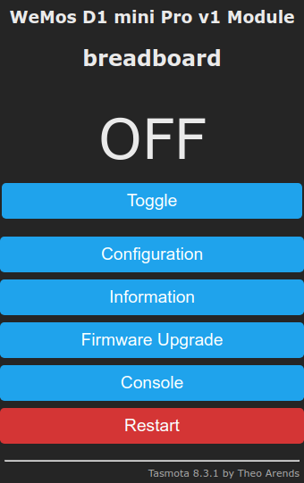
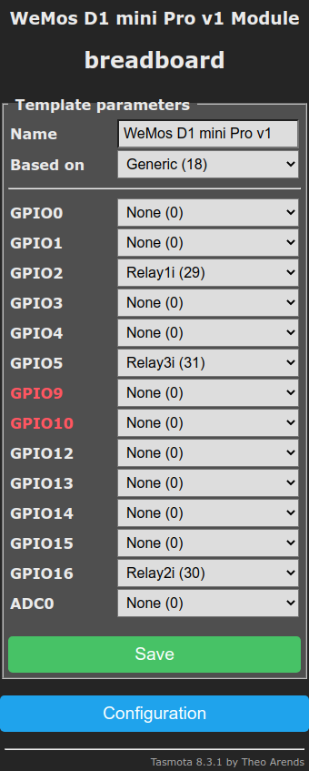
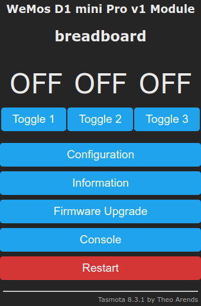
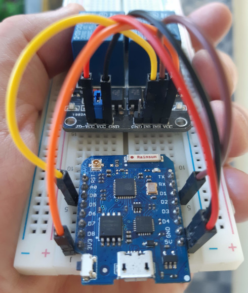

I'm using the retired WeMos D1 mini Pro ESP8266 v1 board (its more-or-less the same as [the v2 edition](https://www.wemos.cc/en/latest/d1/d1_mini_pro.html)).

**NB** These instructions also work with [WeMos D1 mini](https://docs.wemos.cc/en/latest/d1/d1_mini.html).

This board connects to the computer as a USB serial device, as such, you should add your user to the `dialout` group:

```bash
# add ourselfs to the dialout group to be able to write to the USB serial
# device without root permissions.
sudo usermod -a -G dialout $USERNAME
# enter a new shell with the dialout group enabled.
# NB to make this permanent its easier to reboot the system with sudo reboot
#    or to logout/login your desktop.
newgrp dialout
```

Create a python virtual environment in the current directory:

```bash
sudo apt-get install -y --no-install-recommends python3-pip python3-venv
python3 -m venv venv
```

Install [esptool](https://github.com/espressif/esptool):

```bash
source ./venv/bin/activate
# NB this pip install will display several "error: invalid command 'bdist_wheel'"
#    messages, those can be ignored.
# see https://pypi.org/project/esptool/
# see https://github.com/espressif/esptool
# TODO use a requirements.txt file and then python3 -m pip install -r requirements.txt
esptool_version='2.8'
python3 -m pip install esptool==$esptool_version
esptool.py version
```

Dump the information about the esp attached to the serial port:

```bash
esptool.py -p /dev/ttyUSB0 chip_id
```

You should see something alike:

```plain
esptool.py v2.8
Serial port /dev/ttyUSB0
Connecting....
Detecting chip type... ESP8266
Chip is ESP8266EX
Features: WiFi
Crystal is 26MHz
MAC: 60:01:94:19:21:52
Uploading stub...
Running stub...
Stub running...
Chip ID: 0x00192152
Hard resetting via RTS pin...
```

Dump the information about the flash:

```bash
esptool.py -p /dev/ttyUSB0 flash_id
```

You should see something alike:

```plain
esptool.py v2.8
Serial port /dev/ttyUSB0
Connecting....
Detecting chip type... ESP8266
Chip is ESP8266EX
Features: WiFi
Crystal is 26MHz
MAC: 60:01:94:19:21:52
Uploading stub...
Running stub...
Stub running...
Manufacturer: ef
Device: 4018
Detected flash size: 16MB
Hard resetting via RTS pin...
```

This flash device Manufacturer and Device ID is described at [coreboot flashrom repository](https://review.coreboot.org/cgit/flashrom.git/tree/flashchips.h), in this case, its:

```c
#define WINBOND_NEX_ID          0xEF    /* Winbond (ex Nexcom) serial flashes */
#define WINBOND_NEX_W25Q128_V   0x4018  /* W25Q128BV; W25Q128FV in SPI mode (default) */
```

And the actual part number that is printed in the physical flash chip is 25Q128FVSG which supports QPI mode. Since the WeMos board has connected all flash pins to the ESP we can use the qio flash mode.

Flash the device with [Tasmota](https://github.com/arendst/Tasmota) lite:

```bash
tasmota_url='https://github.com/arendst/Tasmota/releases/download/v8.3.1/tasmota-lite.bin'
tasmota_image="$(basename $tasmota_url)"
wget -qO $tasmota_image $tasmota_url
# see https://tasmota.github.io/docs/Getting-Started/#esptoolpy
# see https://github.com/espressif/esptool#flash-modes
# see https://github.com/espressif/esptool/wiki/SPI-Flash-Modes
# NB image_info returns something alike:
#       esptool.py v2.8
#       Image version: 1
#       Entry point: 4010f3e4
#       1 segments
#       Segment 1: len 0x00d80 load 0x4010f000 file_offs 0x00000008 []
#       Checksum: 84 (valid)
esptool.py image_info $tasmota_image
esptool.py -p /dev/ttyUSB0 erase_flash
# NB the --flash_size parameter is not needed because the tool
#    automatically detects the flash size.
esptool.py -p /dev/ttyUSB0 write_flash --flash_mode qio 0x0 $tasmota_image
```

Connect to the board to see its status:

```bash
picocom --baud 115200 /dev/ttyUSB0
```

**NB** You will see some gibberish data after the reset because the bootloader uses a baud rate of `74880`; you can switch to that baudrate to see the bootloader messages.

Connect to the board WiFi network (it will show up as something like `tasmota_192152-0338`), navigate to http://192.168.4.1, and configure it to connect to your WiFi network.

Once it connects to your WiFi network you'll see the tasmota main menu:



Click the `Configuration` button, then `Configure Other`, then set the `Template` to:

```json
{"NAME":"WeMos D1 mini Pro v1","GPIO":[0,0,29,0,0,0,0,0,0,0,0,0,0],"FLAG":0,"BASE":18}
```

Click the `Activate` checkbox, and set the other fields to:



Click `Save`.

After reset, the main menu should be like:



Click the `Toggle` button to toggle the on board LED.

You can further customize the other GPIOs from the `Configuration`, `Configure Template` menu.

For example, to connect a [two channel relay module](https://www.youtube.com/watch?v=b6ZagKRnRdM), configure as:



Click `Save`.

After reset, the main menu should be like:



Then connect the WeMos board to the relay module as:

| WeMos Pin   | Relay Module Pin | Relay Module Connector |
|-------------|------------------|------------------------|
| 5V          | JD-VCC           | 3-pin connector        |
| GND         | GND              | 3-pin connector        |
| 3.3V        | VCC              | 4-pin connector        |
| D0 (GPIO16) | IN1              | 4-pin connector        |
| D1 (GPIO5)  | IN2              | 4-pin connector        |

It should look something like:


